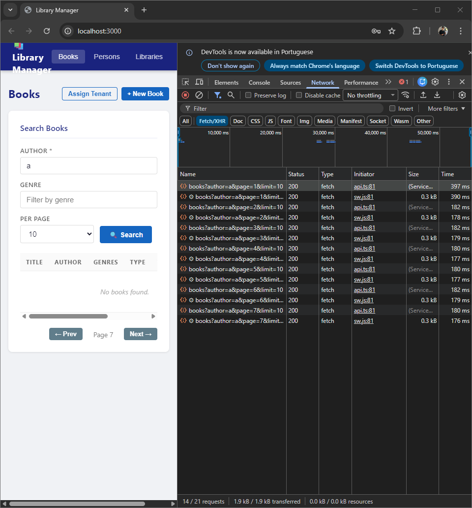
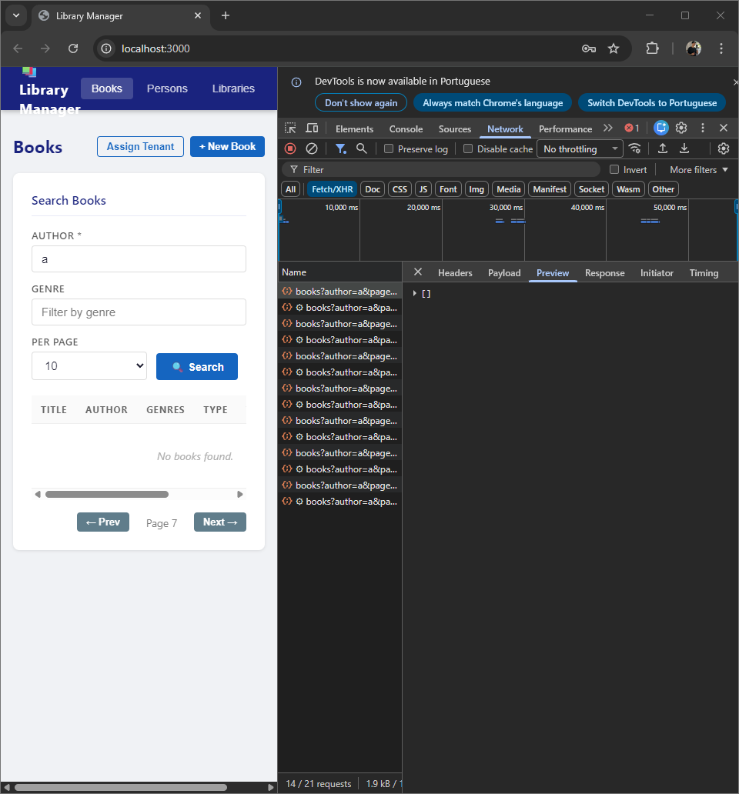
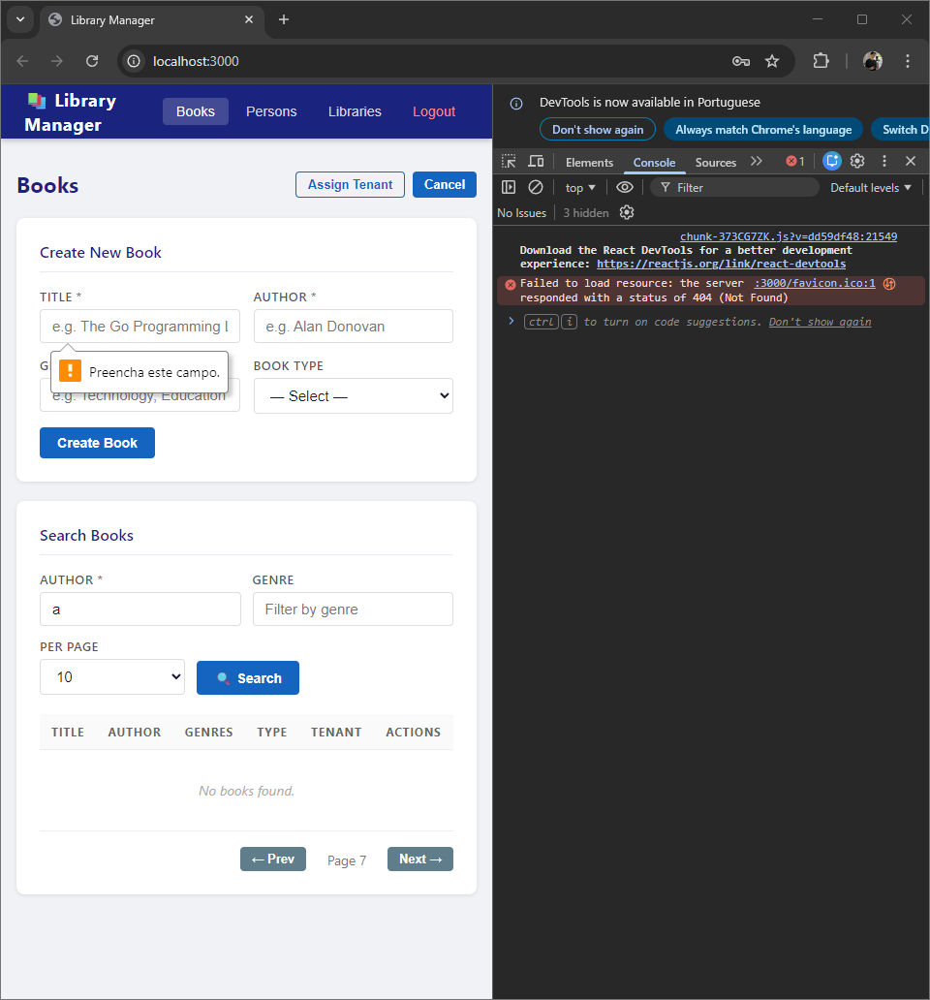
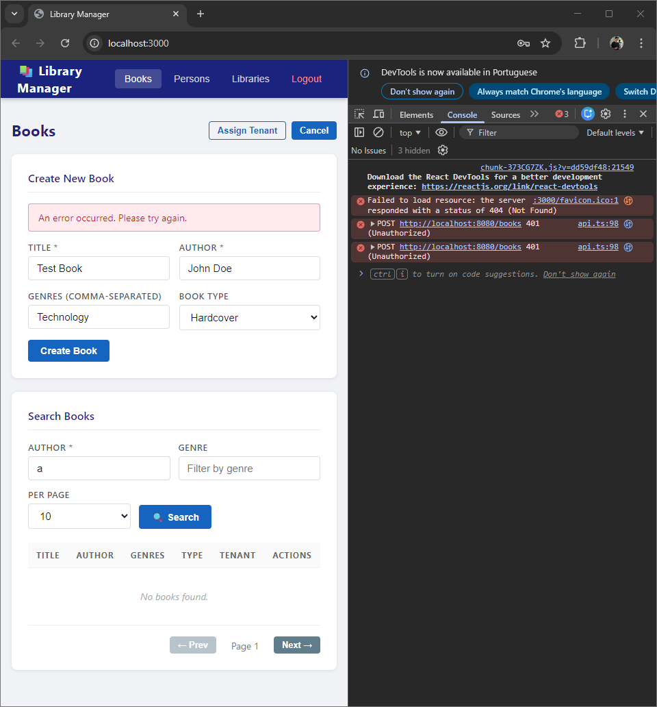
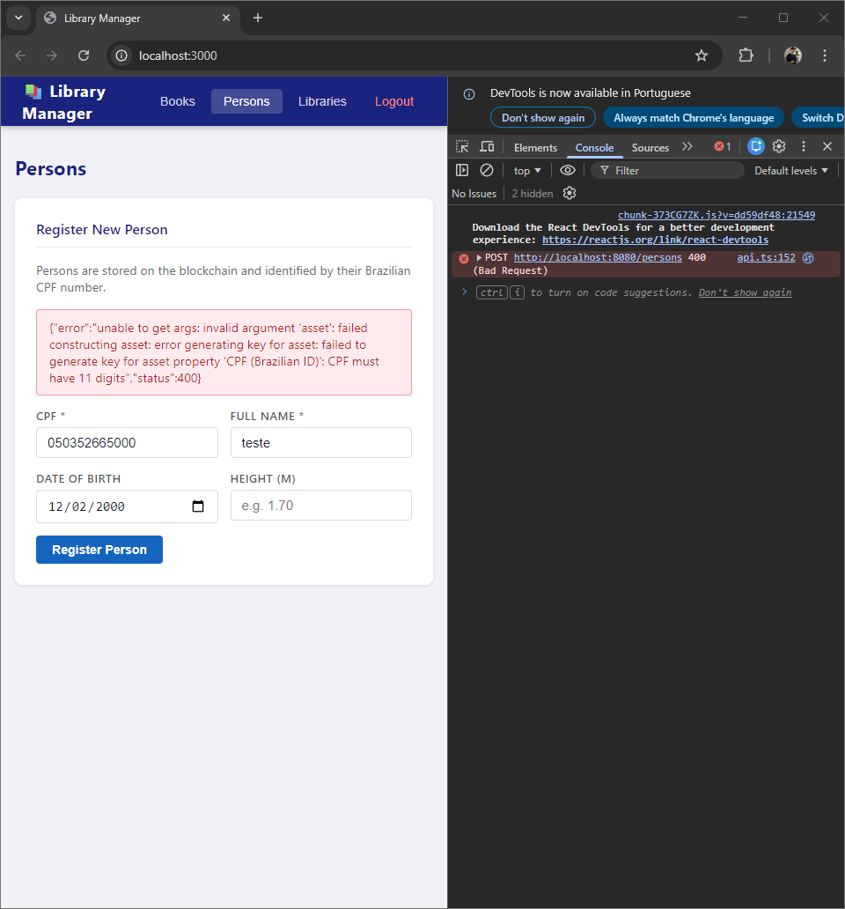
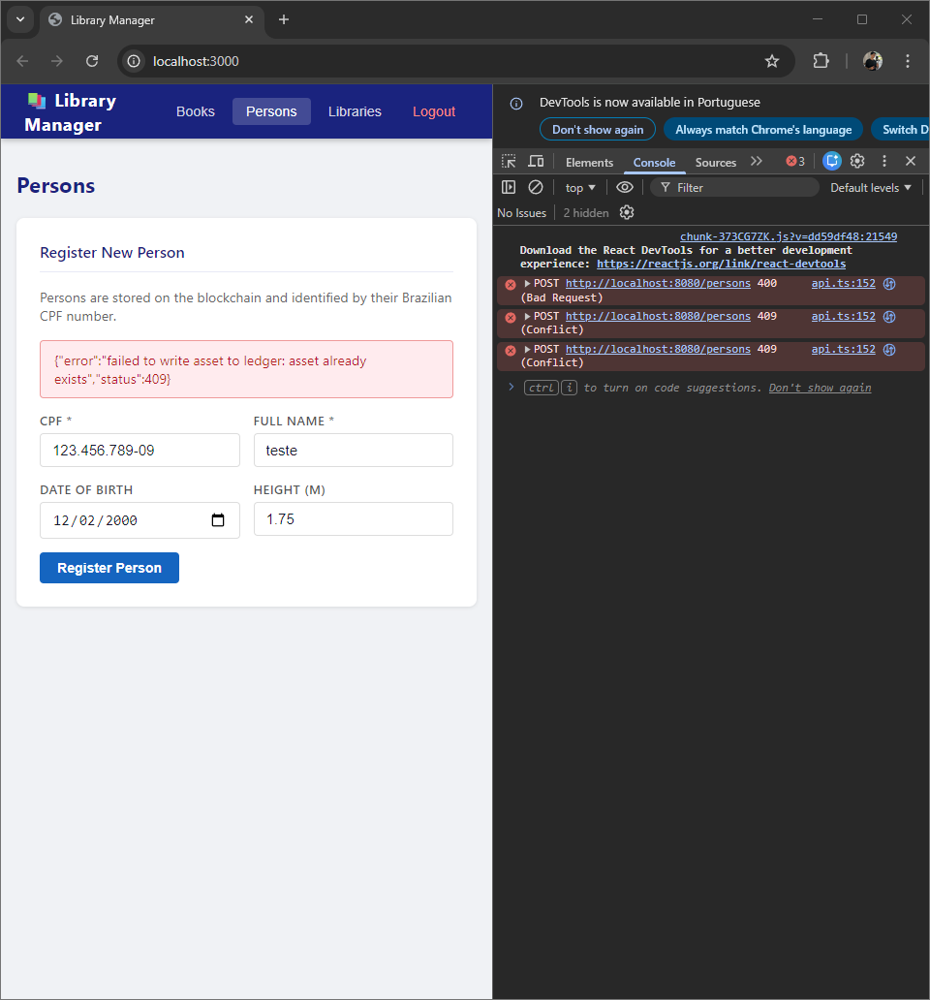

# GoLedger Challenge QA — Bug Report

**Autor:** Douglas Graeff  
**Data:** 30/03/2026  
**Repositório:** https://github.com/graeff01/goledger-challenge-qa  
**Aplicação testada:** GoLedger Challenge QA Edition (API Go/Gin + Frontend React/Vite)

---

## Resumo Executivo

Durante a sessão de testes exploratórios manuais foram identificados **12 bugs**, distribuídos entre as áreas de autenticação, frontend, validação de dados e tratamento de erros. As áreas mais críticas são **autenticação e gerenciamento de sessão**, onde o logout não invalida corretamente o token de acesso, e **exposição de mensagens técnicas internas** ao usuário final, padrão recorrente em todas as seções da aplicação.

| Severidade | Quantidade |
|------------|-----------|
| Critical   | 2         |
| High       | 5         |
| Medium     | 3         |
| Low        | 2         |
| **Total**  | **12**    |

---

## Bugs Encontrados

---

### BUG-001 — Botão "Next" exibido mesmo sem resultados na busca

| Campo | Detalhe |
|-------|---------|
| **Componente** | Web |
| **Página** | Books |
| **Severidade** | High |

**Descrição:**  
Ao realizar uma busca que não retorna resultados, o botão "Next →" continua visível e funcional, permitindo que o usuário navegue por páginas inexistentes indefinidamente.

**Passos para reproduzir:**  
1. Faça login com `admin / admin123`
2. Na página Books, digite `a` no campo Author
3. Clique em Search
4. Observe que a tabela está vazia mas o botão "Next →" aparece
5. Clique em Next repetidamente

**Comportamento esperado:**  
O botão "Next" não deve ser exibido quando não há resultados.

**Comportamento real:**  
O botão "Next" aparece e permite navegar infinitamente por páginas vazias.

**Proposta de correção:**  
Condicionar a exibição do botão "Next" à existência de resultados: só mostrar se `results.length > 0`.

---

### BUG-002 — Chamadas desnecessárias à API ao navegar por páginas sem resultados

| Campo | Detalhe |
|-------|---------|
| **Componente** | Web / API |
| **Página** | Books |
| **Severidade** | High |

**Descrição:**  
Cada clique no botão "Next" sem resultados dispara uma nova chamada à API, mesmo sabendo que a resposta será vazia. Isso desperdiça recursos do servidor desnecessariamente.

**Passos para reproduzir:**  
1. Realize uma busca sem resultados
2. Clique em "Next" múltiplas vezes
3. Abra o DevTools → aba Network
4. Observe as chamadas sendo feitas a cada clique

**Comportamento esperado:**  
Nenhuma chamada deve ser feita quando não há resultados para paginar.

**Comportamento real:**  
A cada clique em "Next" uma nova requisição é enviada para `GET /books?author=a&page=N&limit=10`, todas retornando array vazio `[]`.

**Proposta de correção:**  
Bloquear a paginação no frontend quando a resposta anterior retornar array vazio ou quando o total de resultados for zero.

---

### BUG-003 — Favicon ausente gera erro 404 no console

| Campo | Detalhe |
|-------|---------|
| **Componente** | Web |
| **Página** | Todas |
| **Severidade** | Low |

**Descrição:**  
A aplicação tenta carregar um ícone de favoritos (favicon) que não existe no servidor, gerando um erro 404 visível no console do navegador em todas as páginas.

**Passos para reproduzir:**  
1. Abra qualquer página da aplicação
2. Abra o DevTools → aba Console
3. Observe o erro em vermelho

**Comportamento esperado:**  
Nenhum erro de recurso não encontrado no console.

**Comportamento real:**  
`Failed to load resource: the server :3000/favicon.ico responded with a status of 404 (Not Found)`

**Proposta de correção:**  
Adicionar um arquivo `favicon.ico` na pasta `public/` do projeto React.

---

### BUG-004 — Criação de livro retorna 401 Unauthorized mesmo com usuário logado

| Campo | Detalhe |
|-------|---------|
| **Componente** | Web / API |
| **Página** | Books → Create New Book |
| **Severidade** | Critical |

**Descrição:**  
Ao tentar criar um novo livro com todos os campos preenchidos, a API retorna 401 Unauthorized. O frontend não está enviando o token JWT de autenticação no header da requisição de criação de livro, impedindo completamente essa funcionalidade.

**Passos para reproduzir:**  
1. Faça login com `admin / admin123`
2. Clique em "+ New Book"
3. Preencha Title, Author, Genres e Book Type
4. Clique em "Create Book"
5. Observe o erro na tela e no DevTools → Console

**Comportamento esperado:**  
O livro deve ser criado com sucesso e o usuário deve receber confirmação.

**Comportamento real:**  
A API retorna `401 Unauthorized` e a tela exibe "An error occurred. Please try again."

**Proposta de correção:**  
Verificar o serviço de API no frontend e garantir que o token JWT armazenado após o login seja incluído no header `Authorization: Bearer <token>` em todas as requisições autenticadas, incluindo o `POST /books`.

---

### BUG-005 — Mensagem de erro genérica ao falhar na criação de livro

| Campo | Detalhe |
|-------|---------|
| **Componente** | Web |
| **Página** | Books → Create New Book |
| **Severidade** | Medium |

**Descrição:**  
Quando a criação de um livro falha, o frontend exibe apenas "An error occurred. Please try again." sem informar o motivo real do erro ao usuário.

**Passos para reproduzir:**  
1. Tente criar um livro (ver BUG-004)
2. Observe a mensagem exibida na tela

**Comportamento esperado:**  
Mensagem clara explicando o que deu errado, como "Sessão expirada, faça login novamente" ou "Erro ao salvar. Tente novamente mais tarde."

**Comportamento real:**  
Mensagem genérica "An error occurred. Please try again." sem contexto.

**Proposta de correção:**  
Tratar os diferentes códigos de erro HTTP (401, 400, 500) e exibir mensagens específicas para cada caso.

---

### BUG-006 — Mensagem técnica interna da API exibida ao usuário na tela de Persons

| Campo | Detalhe |
|-------|---------|
| **Componente** | Web |
| **Página** | Persons |
| **Severidade** | High |

**Descrição:**  
Ao tentar registrar uma pessoa com CPF em formato inválido, a mensagem de erro técnica e interna retornada pela API é exibida diretamente na interface, expondo detalhes de implementação ao usuário.

**Passos para reproduzir:**  
1. Acesse a página Persons
2. Preencha o CPF com um número inválido (ex: `050352665000`)
3. Preencha os demais campos
4. Clique em "Register Person"

**Comportamento esperado:**  
Mensagem amigável como "CPF inválido. Digite um CPF com 11 dígitos."

**Comportamento real:**  
`{"error":"unable to get args: invalid argument 'asset': failed constructing asset: error generating key for asset property 'CPF (Brazilian ID)': CPF must have 11 digits","status":400}`

**Proposta de correção:**  
Interceptar os erros retornados pela API no frontend e exibir mensagens traduzidas e amigáveis ao usuário. Nunca exibir o JSON bruto de erro na interface.

---

### BUG-007 — Mensagem técnica interna exibida ao registrar CPF já existente

| Campo | Detalhe |
|-------|---------|
| **Componente** | Web |
| **Página** | Persons |
| **Severidade** | High |

**Descrição:**  
Ao tentar registrar uma pessoa com CPF já cadastrado no sistema, a mensagem técnica interna da API é exibida diretamente na interface, expondo detalhes de implementação.

**Passos para reproduzir:**  
1. Acesse a página Persons
2. Preencha o CPF com `123.456.789-09`
3. Preencha os demais campos
4. Clique em "Register Person"

**Comportamento esperado:**  
Mensagem amigável como "Este CPF já está cadastrado no sistema."

**Comportamento real:**  
`{"error":"failed to write asset to ledger: asset already exists","status":409}`

**Proposta de correção:**  
Tratar o código de resposta 409 Conflict no frontend e exibir mensagem adequada ao usuário.

---

### BUG-008 — Validação de CPF inconsistente entre frontend e API

| Campo | Detalhe |
|-------|---------|
| **Componente** | Web |
| **Página** | Persons |
| **Severidade** | Medium |

**Descrição:**  
O campo CPF aceita tanto números puros quanto CPF formatado com pontos e traço (ex: `123.456.789-09`), mas a API exige apenas os 11 dígitos numéricos. O frontend deveria normalizar o CPF antes de enviar à API, removendo a formatação automaticamente.

**Passos para reproduzir:**  
1. Digite `123.456.789-09` no campo CPF
2. Preencha os demais campos
3. Clique em "Register Person"
4. Observe que a API processa o CPF formatado

**Comportamento esperado:**  
O frontend deve aceitar CPF com ou sem formatação e normalizar para 11 dígitos antes de enviar à API.

**Comportamento real:**  
O frontend envia o CPF exatamente como digitado, sem normalização, podendo causar erros dependendo do formato usado.

**Proposta de correção:**  
Adicionar uma função de sanitização no frontend que remova pontos e traços do CPF antes de enviar: `cpf.replace(/[.-]/g, '')`.

---

### BUG-009 — Erros técnicos exibidos automaticamente ao carregar a página Libraries

| Campo | Detalhe |
|-------|---------|
| **Componente** | Web |
| **Página** | Libraries |
| **Severidade** | High |

**Descrição:**  
Ao acessar a página Libraries, dois erros técnicos aparecem automaticamente na tela sem que o usuário tenha interagido com nada. A página dispara requisições à API no carregamento e exibe os erros retornados diretamente na interface.

**Passos para reproduzir:**  
1. Faça login
2. Clique em "Libraries" no menu
3. Observe os erros exibidos imediatamente

**Comportamento esperado:**  
A página deve carregar limpa, sem erros, aguardando a interação do usuário.

**Comportamento real:**  
Dois erros técnicos aparecem automaticamente:  
- `{"error":"unable to get args: missing argument 'name'","status":400}`  
- `{"error":"failed to get asset from ledger: asset not found","status":400}`

**Proposta de correção:**  
Não disparar requisições automaticamente no carregamento da página sem dados válidos. Aguardar a interação do usuário antes de fazer qualquer chamada à API.

---

### BUG-010 — Mensagens técnicas internas expostas na página Libraries

| Campo | Detalhe |
|-------|---------|
| **Componente** | Web |
| **Página** | Libraries |
| **Severidade** | High |

**Descrição:**  
Assim como nas páginas Books e Persons, a página Libraries também exibe mensagens técnicas internas da API diretamente na interface, sem tratamento adequado. Este é um padrão recorrente em toda a aplicação.

**Passos para reproduzir:**  
1. Acesse a página Libraries
2. Observe as mensagens de erro exibidas automaticamente

**Comportamento esperado:**  
Mensagens amigáveis e contextuais ao usuário.

**Comportamento real:**  
JSON técnico bruto da API exibido na tela.

**Proposta de correção:**  
Implementar um interceptor global de erros no frontend que trate todas as respostas de erro da API e exiba mensagens adequadas, em vez de exibir o JSON bruto.

---

### BUG-011 — Nenhum feedback ao usuário após clicar em "Create Library"

| Campo | Detalhe |
|-------|---------|
| **Componente** | Web |
| **Página** | Libraries |
| **Severidade** | Medium |

**Descrição:**  
Ao preencher o campo Library Name e clicar em "Create Library", nenhum feedback é apresentado ao usuário — nem mensagem de sucesso nem de erro. O usuário não sabe se a ação foi executada ou não.

**Passos para reproduzir:**  
1. Acesse a página Libraries
2. Preencha o campo Library Name com `Biblioteca Central`
3. Clique em "Create Library"
4. Observe que nada muda na tela

**Comportamento esperado:**  
Exibir mensagem de sucesso "Biblioteca criada com sucesso!" ou mensagem de erro detalhada.

**Comportamento real:**  
Nenhuma resposta visual após o clique. A tela permanece idêntica.

**Proposta de correção:**  
Adicionar tratamento de resposta no handler do botão Create Library, exibindo feedback adequado para sucesso e erro.

---

### BUG-012 — Logout não invalida a sessão — token permanece ativo

| Campo | Detalhe |
|-------|---------|
| **Componente** | Web |
| **Página** | Global |
| **Severidade** | Critical |

**Descrição:**  
Após clicar em Logout, o token JWT não é removido corretamente do armazenamento local do navegador. Ao recarregar a página (F5) após o logout, o usuário volta a estar autenticado automaticamente sem precisar inserir credenciais novamente.

**Passos para reproduzir:**  
1. Faça login com `admin / admin123`
2. Clique em "Logout"
3. Observe que a tela de login aparece
4. Pressione F5 para recarregar a página
5. Observe que o usuário volta para a área autenticada sem fazer login

**Comportamento esperado:**  
Após o logout, o token deve ser completamente removido. Qualquer tentativa de acessar a aplicação deve redirecionar para a tela de login.

**Comportamento real:**  
O token permanece no navegador após o logout. Recarregar a página restaura a sessão automaticamente.

**Proposta de correção:**  
Na função de logout, além de redirecionar para a tela de login, garantir a remoção completa do token do `localStorage` ou `sessionStorage`: `localStorage.removeItem('token')` ou `localStorage.clear()`.

---

## Sobre o Processo

Este desafio foi realizado com auxílio ativo de IA (Claude — Anthropic) como ferramenta de apoio ao raciocínio, estruturação dos testes e documentação. Acredito que saber usar IA de forma estratégica — sabendo o que pedir, como avaliar o resultado e quando questionar — é uma habilidade tão relevante quanto qualquer outra no QA moderno. Toda análise, decisão de teste e validação dos bugs foi conduzida e revisada por mim.

---

*Relatório gerado em 30/03/2026*